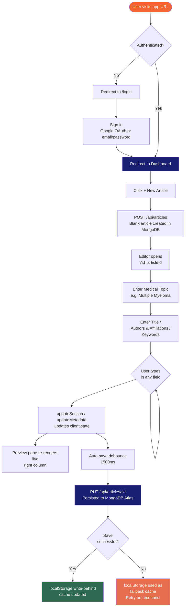

# Product Requirements Document: Medical Article Writer

---

## Document Info

| Field | Value |
|---|---|
| Product | Medical Article Writer |
| Version | 2.0 |
| Last Updated | 2026-04-25 |
| Status | Living Document |

**How to use this document:** Features marked ✅ are shipped. Features marked 📋 are planned. Add new requirements under the relevant module or in Section 9 (Roadmap). Each requirement has a short ID (e.g. `F2-3`) for cross-referencing.

---

## 1. Overview

Medical Article Writer is a browser-based AI writing tool that helps clinicians, researchers, and medical writers compose structured, peer-reviewed review articles. It provides a structured section editor, AI draft generation grounded in real PubMed literature, reference management, and professional export to PDF and Word.

The app runs as a Node/Express server with a modular backend and a separated frontend (HTML, CSS, JS as distinct files). Users sign in with Google or email/password to access a personal dashboard where all their articles are saved server-side in MongoDB Atlas and accessible across devices. Multi-LLM provider support (Groq, OpenAI, OpenRouter; Claude and Gemini in a later sprint) and an agentic writing pipeline are planned.

---

## 2. Problem Statement

Writing a peer-reviewed medical review article is time-intensive and structurally demanding. Authors must:
- Maintain consistent narrative flow across 10+ distinct sections
- Ground every claim in citable evidence
- Balance completeness with conciseness
- Format exports to journal standards

Existing tools (Word, Google Docs) provide no structural guidance, no AI assistance grounded in real literature, and no coherence checking. General AI tools (ChatGPT) hallucinate citations and have no sense of article structure.

---

## 3. Target Users

### Primary — Clinical Researcher / Academic Physician
Writing systematic review or narrative review articles for peer-reviewed journals. Has deep domain expertise but limited time. Wants AI to accelerate drafting, not replace clinical judgement.

### Secondary — Medical Writer
Professional writer creating content for pharmaceutical companies, academic institutions, or clinical trial teams. Needs reliable citation grounding and journal-quality output.

### Tertiary — Resident / Fellow
Writing a first review article as part of training. Needs structural scaffolding and guidance on what to cover in each section.

---

## 4. Goals

| Goal | Metric |
|---|---|
| Reduce time to first full draft | Target: < 2 hours for a 13-section review |
| All AI output grounded in real literature | 100% of generated content uses PubMed abstracts or full-text as context when papers are selected |
| Export ready for journal submission | DOCX and PDF output require no manual reformatting |
| Zero data loss | Auto-save ensures work is never lost on accidental close |
| Article history | Users can access all previously created articles from any device after sign-in |
| AI output strictly grounded in selected sources | Context grounding enforced; strict mode blocks generation entirely without selected sources |
| Support multiple AI providers | Users can bring their own API key for Groq, OpenAI, OpenRouter (Sprint 6); Claude + Gemini (Sprint 8) |

---

## 5. Feature Requirements

Status legend: ✅ Completed · 📋 Planned · 🔄 In Progress

---

### Module F1 — Article Setup

| ID | Feature | Description | Status |
|---|---|---|---|
| F1-1 | Medical Topic | Free-text field that seeds all AI prompts with domain context | ✅ |
| F1-2 | Article Metadata | Title, Authors & Affiliations, Keywords fields | ✅ |
| F1-3 | Live Metadata in Preview | Title, authors, keywords render immediately in the preview pane | ✅ |
| F1-4 | Auto-save | All content auto-saved to server with 1500ms debounce. Restored on page load | ✅ |
| F1-5 | Clear All | Wipes all sections, metadata, library, and server article state with confirmation | ✅ |
| F1-6 | Content Language Selector | "Output Language" dropdown in article metadata (default: English). Injects language instruction into all AI prompts. AI synthesises from English PubMed sources in target language | 📋 Sprint 5 |

---

### Module F2 — Section Editor

| ID | Feature | Description | Status |
|---|---|---|---|
| F2-1 | 13 Pre-defined Sections | Abstract, Introduction, Epidemiology, Pathophysiology, Diagnosis, Staging, Treatment (ND), Treatment (R/R), Novel Therapies, Supportive Care, Future Directions, Conclusion, References — in fixed order | ✅ |
| F2-2 | Accordion Layout | Each section collapses/expands. Only open sections are visible | ✅ |
| F2-3 | Per-section Textarea | Freeform text input for each section | ✅ |
| F2-4 | Notes / Hints Field | Per-section optional input to guide AI generation (e.g. "focus on CAR-T post 2022") | ✅ |
| F2-5 | Per-section Word Count | Live word count badge on each section header | ✅ |
| F2-6 | Total Word Count | Running total in the header bar across all sections and metadata | ✅ |
| F2-7 | Add Custom Section | Modal to add a custom-titled section at any position before References | ✅ |
| F2-8 | Rename Custom Section | Inline rename for user-created sections | ✅ |
| F2-9 | Delete Section | Remove any section (custom or pre-defined) | ✅ |
| F2-10 | Custom Section Persistence | Custom sections saved to server and restored on page load | ✅ |
| F2-11 | AI Section Recommendations | In the "Add Section" modal, AI suggests relevant custom section names based on article topic and existing sections | 📋 Sprint 4 |
| F2-12 | Section Drag-and-Drop Reorder | Drag handle on each section accordion to reorder sections. New order persisted to `state.sections` order | 📋 Sprint 5 |

---

### Module F3 — AI Writing Assistance

All AI calls stream responses token-by-token into the AI suggestion box. The suggestion box supports Apply (copies to textarea) and Dismiss.

| ID | Feature | Description | Status |
|---|---|---|---|
| F3-1 | Generate Draft | Generates a full section draft using topic + section context + notes + selected library papers | ✅ |
| F3-2 | Improve | Rewrites existing section text for academic rigor, flow, and citation style | ✅ |
| F3-3 | Key Points | Lists essential topics, landmark trials, and recent data to cover in a section. Uses selected library papers as grounding | ✅ |
| F3-4 | Expand to Prose | Converts bullet points or rough notes in the textarea into flowing academic prose | ✅ |
| F3-5 | Refine | After generation, user types an instruction (e.g. "make more concise", "add MAIA trial data") to iteratively refine the AI output | ✅ |
| F3-6 | Undo Refinement | Up to 5 levels of undo within the AI suggestion box | ✅ |
| F3-7 | Editable AI Box | AI suggestion text is directly editable before applying | ✅ |
| F3-8 | Section-aware Prompts | Each section has a distinct, topic-aware system prompt (e.g. references section requests Vancouver format, abstract requests structured IMRAD format) | ✅ |
| F3-9 | Paper Flow Checker | AI reviews the full article across all filled sections and returns: overall verdict, section-by-section transition analysis (✅/⚠️/❌), specific issues found, and numbered recommendations | ✅ |
| F3-10 | Context-aware Coherence Fix | "Apply" button on each Flow Check recommendation calls `/api/coherence-fix` — rewrites the section using adjacent section content (prev last 400 chars, next first 400 chars) as context to ensure smooth transitions | ✅ |
| F3-11 | User-supplied Context ("Add Your Data") | Collapsible "Add Your Data" textarea per section. User-pasted content (study data, notes, institutional data) is passed as additional context to all AI actions for that section | 📋 Sprint 5 |
| F3-12 | Visual AI Confidence Indicator | Color-coded bar (green = 3+ sources / yellow = 1–2 sources / red = 0 sources) under each AI action button. Tooltip shows supporting PMIDs used for the last generation | 📋 Sprint 4 |
| F3-13 | Context Grounding | Soft mode (default): warning shown when generating without selected refs. Strict mode (user-configurable): blocks AI generation entirely unless ≥1 library paper is selected | 📋 Sprint 4 |

---

### Module F4 — Reference Management

| ID | Feature | Description | Status |
|---|---|---|---|
| F4-1 | Reference Library Panel | Collapsible panel with three tabs: References, PubMed Search, and Ask Library (RAG) | ✅ |
| F4-2 | PMID Import | Paste comma- or newline-separated PMIDs; fetch metadata + OA full-text from NCBI in batch | ✅ |
| F4-3 | OA Full-text Enrichment | For Open Access papers, fetches full-text via PMC BioC API (intro, results, discussion, conclusion, abstract) up to 6000 chars | ✅ |
| F4-4 | OA Badge | Library entries sourced from OA papers display an "OA" badge | ✅ |
| F4-5 | Library AI Toggle | Per-entry "Use in AI" toggle. Selected entries feed their abstract/full-text as context to all AI actions | ✅ |
| F4-6 | Select All / Deselect All | Bulk toggle all library entries for AI context | ✅ |
| F4-7 | Sync References Section | Overwrites the References textarea with a numbered Vancouver-style list generated from the library | ✅ |
| F4-8 | Remove from Library | Delete individual entries from the library | ✅ |
| F4-9 | PubMed Search Tab | Live search PubMed by keyword (defaults to Medical Topic if blank). Returns up to 10 results with title, authors, journal, year, PMID, and abstract | ✅ |
| F4-10 | Add to Library from Search | Single "Add to Library" button per search result. Adds article to library (selected by default), appends citation to References section, and marks button as "✓ In Library" | ✅ |
| F4-11 | Citation Linking in Preview | `[Author et al., Year]` placeholders in section text are converted to superscript reference numbers in the preview, linked to the matching library entry | ✅ |
| F4-12 | Unmatched Citation Highlight | Citations not found in the library are highlighted in amber in the preview | ✅ |

---

### Module F5 — Tables

| ID | Feature | Description | Status |
|---|---|---|---|
| F5-1 | Generate Table | Per-section modal: user describes the table in plain English; AI returns a formatted HTML table with caption, headers, and data rows. Grounded in selected library papers if present | ✅ |
| F5-2 | Table Preview in Editor | Generated tables render inline below the section textarea | ✅ |
| F5-3 | Delete Table | Remove any generated table from a section | ✅ |
| F5-4 | Tables in Preview | Tables render in the article preview pane with journal-style formatting | ✅ |
| F5-5 | Tables in DOCX Export | Tables are exported as native Word tables in the DOCX file | ✅ |

---

### Module F6 — Export

| ID | Feature | Description | Status |
|---|---|---|---|
| F6-1 | PDF Export (client-side fallback) | Client-side export via html2pdf.js. Renders `#article-preview` directly — WYSIWYG output on A4. Kept as fallback when server PDF unavailable | ✅ |
| F6-2 | DOCX Export | Server-side export via `docx` package. Produces properly formatted Word document with title, authors, keywords, section headings, body paragraphs, and tables | ✅ |
| F6-3 | Auto-named File | Exported files are named from the article title (sanitised, underscored, 60-char max) | ✅ |
| F6-4 | DOCX Justified Text | Body paragraphs in DOCX export use justified alignment | 📋 Sprint 4 |
| F6-5 | Export Controls Relocation | Export buttons (PDF + DOCX) moved to the preview pane top bar for better discoverability | 📋 Sprint 4 |
| F6-6 | Server-side PDF via Puppeteer | `POST /api/export-pdf-server` endpoint using `puppeteer-core` + system Chromium. Primary PDF path. Produces pixel-perfect PDF with correct page breaks, headers (article title), footers (page numbers), and consistent font rendering | 📋 Sprint 4 |
| F6-7 | LaTeX Export | Export article as `.tex` file for journal submission (Elsevier, Springer). Sections mapped to standard LaTeX article structure | 📋 Sprint 7 |

---

## 6. User Flows

### UF-1: Start a New Article



1. Open app at `http://localhost:3000`
2. Enter **Medical Topic** (e.g. "Multiple Myeloma") — this seeds all AI calls
3. Enter Article Title, Authors & Affiliations, Keywords
4. Preview pane on the right updates live
5. Work is auto-saved to the server; resuming later restores all content

---

### UF-2: Write a Section with AI (Generate Draft)

1. Click a section header to expand it
2. *(Optional)* Type notes in the hints field — e.g. "emphasise MAIA trial, include updated NCCN guidelines"
3. *(Optional)* Ensure relevant papers are selected in the Reference Library ("✓ In AI")
4. Click **✨ Generate Draft**
5. AI streams a draft into the suggestion box below the textarea
6. Review and edit the suggestion directly in the box
7. *(Optional)* Type a refinement instruction and click **↺ Refine**
8. *(Optional)* Click **↩ Undo** to revert a refinement
9. Click **Apply** — draft moves into the section textarea
10. Content is auto-saved

---

### UF-3: Improve Existing Text

1. Write or paste content into any section textarea
2. Click **✨ Improve**
3. AI rewrites the text for academic rigour, flow, and citation placeholders
4. Review → Apply or Dismiss

---

### UF-4: Bullet Points to Prose

1. Paste rough notes or bullet points into a section textarea
2. Click **✍ Expand to Prose**
3. AI converts them to flowing academic prose, preserving all content
4. Review → Refine if needed → Apply

---

### UF-5: Discover What to Cover (Key Points)

1. *(Optional)* Select relevant library papers ("✓ In AI")
2. Click **💡 Key Points** on any section
3. AI returns a bulleted list of essential topics, landmark trials, and recent data specific to that section
4. Use the list as a writing guide — it appears in the suggestion box (Apply disabled; informational only)

---

### UF-6: Import References by PMID

1. Open **Reference Library** panel → **References** tab
2. Paste PMIDs (comma- or newline-separated) into the text area
3. Click **Fetch References**
4. App calls NCBI: fetches metadata for all PMIDs, checks PMC for OA full-text
5. Articles appear in the library numbered, with OA badge where applicable
6. By default all fetched articles are selected ("✓ In AI")
7. Toggle individual articles off with the "Use in AI" / "✓ In AI" button
8. Click **↺ Sync References** to overwrite the References section with a numbered Vancouver list

---

### UF-7: Find References via PubMed Search

1. Open **Reference Library** panel → **PubMed Search** tab
2. Type a query (or leave blank to use the Medical Topic)
3. Click **Search** or press Enter
4. Up to 10 results appear with title, authors, journal, year, PMID, and abstract
5. Click **Show more** to expand a long abstract
6. Click **+ Add to Library** on any result
7. Article is added to the Reference Library (selected by default), citation appended to the References section
8. Button changes to **✓ In Library** (disabled) — no duplicates possible
9. Switch to **References** tab to manage AI toggles

---

### UF-8: Generate a Table

1. Expand a section, click **+ Table**
2. Describe the table — e.g. "Comparison of approved CAR-T therapies: product, trial, ORR, PFS, key toxicities"
3. Click **Generate Table**
4. AI returns a formatted HTML table; it renders inline below the section textarea and in the preview
5. Table is included in both PDF and DOCX exports
6. Click **✕** on any table card to delete it

---

### UF-9: Check Paper Coherence

1. Fill content in at least 2 sections
2. Scroll to the **Check Paper Flow** panel at the bottom of the left column
3. Click **Run Check**
4. AI analyses all filled sections and streams back:
   - **Overall Assessment** — one-sentence verdict
   - **Section-by-Section Flow** — ✅ / ⚠️ / ❌ for each adjacent section pair with reasons
   - **Key Issues Found** — specific problems named by section
   - **Recommendations** — numbered, actionable fixes
5. Return to specific sections and use **↺ Refine** or edit directly to address issues
6. Re-run the check to verify improvements

---

### UF-10: Export the Article

1. Review the article in the live preview pane (right column)
2. For PDF: click **⬇ PDF** — server renders article via Puppeteer and downloads A4 PDF (falls back to html2pdf.js if server unavailable)
3. For Word: click **⬇ DOCX** — server builds a `.docx` file with all sections and tables, browser downloads it
4. File is named from the article title automatically

---

### UF-11: Sign In

1. User visits the app URL
2. If not authenticated, redirected to login page
3. Click **Sign in with Google** (or use email/password)
4. Google OAuth consent screen — user grants permission (or credentials validated for email/password)
5. Redirected back to the app, session established
6. Lands on the article dashboard (UF-12)

---

### UF-12: View and Manage Articles (Dashboard)

1. After sign-in, user sees a grid/list of all their articles
2. Each card shows: article title (or "Untitled"), medical topic, last updated date, total word count
3. Click any card → opens the article in the editor
4. Click **+** → creates a new blank article and opens the editor (UF-13)
5. Click the delete icon on a card → confirmation dialog → article permanently deleted

---

### UF-13: Create a New Article

1. From the dashboard, click the **+** (New Article) button
2. A new blank article is created server-side with a default title "Untitled Article"
3. Editor opens with all 13 sections empty
4. User fills in Medical Topic, Title, Authors, Keywords
5. Changes auto-save to the server every 1500ms
6. User can return to the dashboard at any time; the article persists under their account

---

## 7. Technical Constraints

| Constraint | Detail |
|---|---|
| Runtime | Node.js v18+ |
| AI Provider | Groq (default, `llama-3.3-70b-versatile`). Multi-provider: OpenAI + OpenRouter (Sprint 6); Claude + Gemini (Sprint 8) |
| PubMed | NCBI E-utilities (free). User-supplied NCBI key via Settings (F13-3) raises rate limit from 3 to 10 req/s |
| Storage | MongoDB Atlas — two projects: `article-writer-dev` (M0 free) + `article-writer-prod` (M0 free, upgrade to M10 when needed) |
| Auth | Google OAuth 2.0 via Passport.js ✅ (Sprint 1). Local email/password ✅ (Sprint 1) |
| Hosting | Railway Hobby plan. Two projects: `article-writer-dev` (auto-deploy from `dev` branch) + `article-writer-prod` (auto-deploy from `main`). 512MB RAM per project |
| Versioning | Fully automated via `semantic-release` + conventional commits. `feat:` → MINOR, `fix:` → PATCH, `feat!:` → MAJOR. Git short SHA suffix per deploy. App footer shows `v1.0.0-dev · sha` (dev) / `v1.0.0 · sha` (prod) |
| Streaming | All AI endpoints use chunked transfer encoding (`text/plain`) |
| PDF | `puppeteer-core` + system Chromium (server-side primary, Sprint 4). `html2pdf.js` client-side fallback |
| DOCX | Server-side via `docx` npm package |
| Vector store | Pinecone serverless (`@pinecone-database/pinecone@7.2.0`). Index: `article-writer`. Requires `PINECONE_API_KEY` + `PINECONE_INDEX_NAME` env vars |
| Embeddings | Mistral `mistral-embed` (1024-dim). Requires `MISTRAL_API_KEY`. BM25 keyword fallback when no key is set |
| Agent framework | Custom tool-loop agent in `src/services/ragAgentService.js` (Sprint 8). Mastra multi-agent pipeline planned (future) |
| MCP | Custom MCP servers: PubMed, Dimensions, quality-check, article-writer, Tavily web search, ClinicalTrials.gov (planned future) |
| Section content | Each section stores `{ prose: string, tables: [] }`. Max ~2000 chars per section sent to coherence check |

---

## 8. Known Limitations

- `localStorage` cap (~5MB) limits total article size including library *(resolved by F11-3 server-side storage ✅)*
- No multi-user or collaboration support *(isolated user accounts shipped Sprint 1; sharing + real-time collab planned Sprint 6 + Sprint 8)*
- OA full-text availability depends on PMC Open Access Subset; most articles provide abstract only
- Citation matching (`[Author et al., Year]`) is fuzzy — relies on surname + year; disambiguation not supported
- No version history beyond 5-step refinement undo within a session *(F11-11 versioning planned Sprint 6)*
- Railway Hobby tier (512MB RAM) limits concurrent heavy operations — Puppeteer PDF + active LLM stream may exhaust memory under load; `puppeteer-core` + system Chromium mitigates this vs bundled Chromium
- RAG pipeline accuracy (Sprint 7) depends on embedding model quality and chunking strategy
- Agent mode (Sprint 8) requires conventional commit discipline for semantic-release to work correctly

---

## 9. Infrastructure & Environments

### Environment separation

| Variable | Development | Production |
|---|---|---|
| `NODE_ENV` | `development` | `production` |
| `MONGODB_URI` | Atlas `article-writer-dev` M0 | Atlas `article-writer-prod` M0/M10 |
| `GOOGLE_CALLBACK_URL` | `http://localhost:3000/auth/google/callback` | Railway prod URL + `/auth/google/callback` |
| `SESSION_SECRET` | Any local string | 32-byte random hex |
| `LOG_LEVEL` | `debug` | `info` |
| `PORT` | `3000` | Set by Railway |
| `BUILD_SHA` | Set by CI (GitHub Actions) | Set by CI (GitHub Actions) |
| `ENCRYPTION_KEY` | Any 32-char string | 32-byte random hex (for BYOK key encryption) |
| `PINECONE_API_KEY` | Pinecone API key | Same key used in both dev and prod (single serverless index) |
| `PINECONE_INDEX_NAME` | `article-writer` | Pinecone index name |
| `MISTRAL_API_KEY` | Mistral API key | Used for `mistral-embed` embeddings. BM25 fallback if absent |

### File structure

```
.env                 # Production secrets (gitignored)
.env.development     # Dev overrides — local Atlas dev, localhost callback (gitignored)
.env.example         # Template documenting all variables (tracked in git)
```

### dotenv loading

`server.js` loads the correct file based on `NODE_ENV`:
```js
const _envFile = process.env.NODE_ENV === 'production' ? '.env' : `.env.${process.env.NODE_ENV || 'development'}`;
require('dotenv').config({ path: _envFile });
```
Production loads `.env`; development loads `.env.development`; test environment uses `mongodb-memory-server` (no `.env.test` needed).

### CI/CD

- **CI** (`ci.yml`): on every push → `npm run lint` + `npm test`
- **Deploy dev** (`deploy-dev.yml`): on push to `dev` after CI passes → Railway dev deploy + inject `BUILD_SHA`
- **Deploy prod** (`deploy-prod.yml`): on push to `main` after CI passes → `semantic-release` bumps version → Railway prod deploy + inject `BUILD_SHA`

### Manual setup required (one-time, outside CI)

1. MongoDB Atlas: two projects (`article-writer-dev`, `article-writer-prod`), each with an M0 free cluster, dedicated DB user, and appropriate network access rules
2. Railway: two projects (`article-writer-dev` → `dev` branch, `article-writer-prod` → `main` branch), all env vars set in Variables tab
3. Google OAuth: add Railway dev + prod callback URIs to Authorized Redirect URIs in Google Cloud Console
4. GitHub branch protection: require PR + status checks on both `main` and `dev`

---

### Module F8 — Planned: Editor Improvements

| ID | Feature | Description | Status |
|---|---|---|---|
| F8-1 | Rich text editor | Replace plain textarea with lightweight rich-text editor (bold, italic, lists) | 📋 |
| F8-2 | Section reordering | Drag-and-drop to reorder sections *(see F2-12)* | 📋 Sprint 5 |
| F8-3 | Word count targets | Per-section target word counts with progress indicator | 📋 |
| F8-4 | Spell Check | Browser-native `spellcheck="true"` on all textareas | 📋 Sprint 5 |

---

### Module F10 — User Authentication

| ID | Feature | Description | Status |
|---|---|---|---|
| F10-1 | Google Sign-in | OAuth 2.0 login via Google. Users authenticate with their Google account — no separate password | ✅ |
| F10-2 | Session management | Server-side session persists login state. Auto-redirect to login page if unauthenticated | ✅ |
| F10-3 | Sign-out | Clear session and redirect to login page | ✅ |
| F10-4 | User identity in header | Display signed-in user's name and avatar (from Google profile) in the app header | ✅ |

---

### Module F11 — Article Management

| ID | Feature | Description | Status |
|---|---|---|---|
| F11-1 | Article dashboard | Landing page after login showing all articles belonging to the user. Displays article title, topic, last updated date, and word count | ✅ |
| F11-2 | New article button | "+" button on the dashboard to create a new blank article and open it in the editor | ✅ |
| F11-3 | Server-side article storage | Each article (sections, metadata, library, custom sections) stored server-side in MongoDB, linked to the user's account | ✅ |
| F11-4 | Auto-save to server | On every change, article state is persisted to the server (debounced, 1500ms) | ✅ |
| F11-5 | Open existing article | Click any article on the dashboard to open it in the editor | ✅ |
| F11-6 | Delete article | Delete an article from the dashboard with confirmation. Permanently removes all sections, library, and tables | ✅ |
| F11-7 | Article last-updated timestamp | Each article card on the dashboard shows when it was last edited | ✅ |
| F11-8 | Dashboard List & Card Views | Toggle between card grid and compact list/table view. Both views show title, topic, word count, created date, and last modified date | 📋 Sprint 5 |
| F11-9 | Dashboard Filtering | Text search + date range + word count filter. Active filters shown as removable chips. Clear Filters resets all | 📋 Sprint 5 |
| F11-10 | View Mode + Article Locking | View (read-only) and Edit buttons on dashboard. Explicit Lock/Unlock action stored as `article.isLocked`. When locked: all textareas disabled, AI buttons hidden, auto-save skipped, padlock icon in editor header. Only article owner can lock/unlock | 📋 Sprint 6 |
| F11-11 | Article Versioning | Auto-save snapshots every 5 minutes with change detection (hash of `state.sections`), capped at 50 per article. Manual "Save Version" button with user-supplied label. Version history panel with timestamps, labels, word counts, and Restore action. Restore saves current state as a new version first | 📋 Sprint 6 |
| F11-12 | Article Sharing | Shareable read-only link (UUID `shareToken`). Owner grants editor access per-user (named collaborators with roles). Last-write-wins for concurrent edits. `GET /share/:token` requires no auth | 📋 Sprint 6 |
| F11-12-RT | Real-time Collaboration | Socket.io + CRDT-based real-time concurrent editing. Requires architecture spike | 📋 Sprint 8 |
| F11-13 | Clone Article | One-click duplicate from dashboard. Creates new article with same content, title prefixed "Copy of …", same owner, reset timestamps. Opens in editor | 📋 Sprint 5 |

---

### Module F12 — Testing & Quality

| ID | Feature | Description | Status |
|---|---|---|---|
| F12-1 | Unit tests for server endpoints | Jest test suite covering all `/api/*` endpoints with mocked Groq and NCBI calls. Validates request validation, error handling, and response shape | ✅ |
| F12-2 | Unit tests for frontend utilities | Tests for `parsePubMedXML`, `enhanceCitations`, `getSelectedPubmedContext`, `wordCount`, and `htmlEsc` functions | ✅ |
| F12-3 | Integration tests for PubMed pipeline | Tests for the full PMID fetch → enrich → parse flow with recorded NCBI fixture responses | ✅ |
| F12-4 | E2E tests for critical user flows | Playwright tests covering: article creation, section generate/apply, add to library, PDF/DOCX export, Google login flow | ✅ |
| F12-5 | CI pipeline — test gate | GitHub Actions workflow that runs the full test suite on every PR. PRs cannot be merged if tests fail | ✅ |
| F12-6 | CI pipeline — lint gate | ESLint run on every PR to catch syntax errors and undefined references before merge | ✅ |

---

## 10. Roadmap / Backlog

### Module F7 — Planned: Citation & Reference Improvements

| ID | Feature | Description | Status |
|---|---|---|---|
| F7-1 | DOI / URL support | Allow importing references by DOI or URL in addition to PMID | 📋 |
| F7-2 | Citation format selector | Export citations in Vancouver, APA, AMA, or custom format | 📋 |
| F7-3 | Section-specific full-text | Store BioC sections (intro, results, discussion) separately to enable section-matched literature context | 📋 |

---

### Module F13 — Settings & Configuration

| ID | Feature | Description | Sprint |
|---|---|---|---|
| F13-1 | BYOK — LLM API Key | User enters provider API key (Groq / OpenAI / OpenRouter / Claude / Gemini). Encrypted with AES-256-GCM at rest (`ENCRYPTION_KEY` env var). Falls back to server env key if user has none | ✅ |
| F13-2 | LLM Model Selector | Provider + model dropdown in Settings. Dynamic model list via `GET /api/llm/models`. Stored per-user in `user.llmConfig`. Sprint 6: Groq + OpenAI + OpenRouter. Sprint 8: Claude + Gemini | ✅ (Groq) |
| F13-3 | NCBI API Key | User supplies own NCBI key in Settings. Stored in `user.researchConfig`. Raises PubMed rate limit to 10 req/s | ✅ |
| F13-4 | Default Config + Reset-to-Defaults | `DEFAULT_CONFIG` constant (Groq / llama-3.3-70b-versatile / HuggingFace embeddings / LanceDB / Light theme / English / Strict mode OFF). "Modified" badge on each changed setting. "Reset all to defaults" restores `DEFAULT_CONFIG` in one click | ✅ |
| F13-5 | Groq API Key Pool Rotation | System supports up to 4 Groq API keys (`GROQ_API_KEY` through `GROQ_API_KEY_4`). On HTTP 429, auto-rotates to the next available key — transparent to the user. Prevents rate-limit errors during heavy use | ✅ |

---

### Module F14 — Research Integrations

| ID | Feature | Description | Sprint |
|---|---|---|---|
| F14-1 | Dimensions.ai Integration | Search Dimensions bibliometric database alongside PubMed. Requires Dimensions API key (free academic tier at dimensions.ai). Broader coverage for non-biomedical research | 📋 7 |
| F14-2 | Semantic Scholar Integration | Search Semantic Scholar API (free, no key required). Citation graph + related-paper suggestions alongside PubMed results | 📋 7 |

---

### Module F15 — UI Preferences

| ID | Feature | Description | Sprint |
|---|---|---|---|
| F15-1 | Dark Mode | GSK-compliant dark theme: dark backgrounds with GSK orange (#F36633) and navy (#1A1F71) as accent colors. `[data-theme="dark"]` CSS variable toggled by header button. Preference persists to `localStorage`. RULES.md updated to permit dark theme variant | 📋 5 |
| F15-2 | Font Size Control | `--base-font-size` CSS variable. +/− controls in header. Resets to default. Persists to `localStorage` | 📋 5 |

---

### Module F16 — Document Intelligence & RAG

| ID | Feature | Description | Sprint |
|---|---|---|---|
| F16-1 | Per-paper Full-text Badge | Library entries show "Full text" (green) or "Abstract only" (grey) badge based on whether a full text has been extracted and stored | ✅ Sprint 8 |
| F16-2 | PDF Upload + Text Extraction | Per-paper ↑ PDF button in Reference Library. Extracts prose and markdown-formatted tables from uploaded PDF (`pdf-parse@1.1.1`). Stored as `library[pmid].fullText` and `library[pmid].tables` in MongoDB | ✅ Sprint 8 |
| F16-3 | Vector Embeddings | Chunks embedded via Mistral `mistral-embed` (1024-dim, `MISTRAL_API_KEY`). BM25 keyword scoring used as fallback when no embedding key is configured | ✅ Sprint 8 |
| F16-4 | Vector Store | Pinecone serverless (`@pinecone-database/pinecone@7.2.0`). Index: `article-writer`, namespace per user. Each chunk stored with `articleId`, `pmid`, `chunkType` (prose/abstract/table), and `chunkIndex` metadata. Delete uses query-then-delete-by-IDs pattern (Pinecone serverless does not support delete by metadata filter) | ✅ Sprint 8 |
| F16-5 | Re-index RAG | "⟳ Re-index RAG" button in References tab. Calls `POST /api/rag/ingest/:articleId` to delete stale vectors and re-upsert all library papers | ✅ Sprint 8 |
| F16-6 | Agentic RAG Pipeline ("Ask Library") | Third tab in Reference Library. User submits a natural language question → intent classification (GENERAL / SECTION_SPECIFIC / COMPARISON / STATS) → Pinecone top-8 semantic search (or BM25 fallback) → tool-augmented synthesis prompt → Groq streams answer with inline citations → SSE events (`thinking`, `answer`, `citation`, `done`) | ✅ Sprint 8 |
| F16-7 | Insert RAG Answer | After a RAG answer streams in, "Insert into section ↓" button inserts the answer into the active section's AI suggestion box | ✅ Sprint 8 |
| F16-8 | Word/Dimensions Document Upload | Upload Word files; Dimensions.ai integration for broader bibliometric coverage | 📋 Future |

---

### Module F17 — Advanced Quality Checks

| ID | Feature | Description | Sprint |
|---|---|---|---|
| F17-1 | Grammar & Style Check | `POST /api/grammar-check` (Groq-powered). Checks passive voice, sentence length, academic register, hedging. Section-by-section report panel with issue cards | ✅ |
| F17-2 | Grammar AI Apply Fixes | "✨ Apply fixes" button on grammar results panel. Calls `POST /api/grammar-fix` — streams minimally-corrected section text into AI suggestion box. User accepts/rejects as normal | ✅ Sprint 8 |
| F17-3 | Section-specific Journal Rules | Every AI generation call uses section-specific prompt rules (`getSectionRequirements`): abstract citation prohibition, introduction paragraph structure, discussion limitations mandate, methods/results original-research rules, universal academic writing rules across all sections | ✅ Sprint 8 |
| F17-4 | EQUATOR Checklist Validation | Auto-fill structured reporting checklists from article content: CONSORT (RCT), PRISMA (systematic review), STROBE (observational). Manual checklist items with checkboxes for items AI cannot auto-assess | 📋 7 |
| F17-5 | Journal-specific Formatting Check | User selects target journal. AI checks article against journal style guide (word count limits, required sections, reference format, abstract structure) | 📋 7 |

---

### Module F18 — Agentic Writing Pipeline

Both agentic modes coexist permanently alongside the existing manual incremental mode. Manual mode is never removed.

| ID | Feature | Description | Sprint |
|---|---|---|---|
| F18-1 | One-Click Full Draft (Agentic MVP) | "Write Full Article" button. Sequentially calls existing AI endpoints for each section in order. Streamed progress panel shows current section. Human approve/skip checkpoint per section before proceeding to the next. Approved sections populated in editor; skipped sections unchanged | 📋 5 |
| F18-2 | True Agent Orchestration | Mastra-based multi-agent pipeline: **Planner** → **Researcher** (searches PubMed/Dimensions via MCP tools) → **Generator** (writes each section) → **Validator** (coherence + grammar checks) → **Formatter** (export prep). Human feedback at each stage. Custom MCP servers: PubMed, Dimensions, quality-check, article-writer, Tavily web search, ClinicalTrials.gov, FDA OpenFDA | 📋 8 |

---

### Module F19 — Multilingual Support

| ID | Feature | Description | Sprint |
|---|---|---|---|
| F19-1 | Content Language Selector | See F1-6. "Output Language" dropdown in article metadata. All AI prompts inject: *"Write in [language] at a clinical academic level."* PubMed search still returns English abstracts; AI synthesises in target language | 📋 5 |
| F19-2 | UI Localization (i18n) | Extract all UI strings to locale files (`en.json`, `es.json`, etc.). Library: `i18next`. ~200–300 strings. GSK brand colors/logo unchanged; only text localizes | 📋 8 |

---

### Module F20 — UX Polish

| ID | Feature | Description | Sprint |
|---|---|---|---|
| F20-1 | LaTeX Export | See F6-7. Export article as `.tex` file. Sections mapped to standard LaTeX article structure | 📋 7 |
| F20-2 | Section Drag-and-Drop Reorder | See F2-12. Drag handle on each section accordion. New order persisted | 📋 5 |
| F20-3 | Journal Target Selector | User picks target journal. AI adjusts style + word count limits. Submission checklist per journal | 📋 7 |
| F20-4 | Keyboard Shortcuts | Ctrl+G (generate), Ctrl+Enter (apply), Ctrl+Z (undo), Ctrl+Shift+F (flow check) | 📋 5 |

---

### Module F21 — Writing Style Capture

| ID | Feature | Description | Sprint |
|---|---|---|---|
| F21-1 | Style Calibration | Paste writing sample (300–500 words) per article. AI analyses and generates a structured `styleProfile`: avg sentence length, active/passive voice ratio, formality score, hedging frequency, citation density. Stored as `article.writingStyle` | 📋 6 |
| F21-2 | Style Report Card | Visual card displaying style metrics after calibration. User can recalibrate with a new sample or clear the profile | 📋 6 |
| F21-3 | Style Injection | All AI generation endpoints read `article.writingStyle.styleProfile` and append a style instruction to the system prompt: *"Write in the following academic style: [profile]"* | 📋 6 |

---

## 11. Open Questions

| # | Question | Raised | Resolution |
|---|---|---|---|
| Q1 | Should the topic field lock the article to a specific disease (e.g. MM) or remain fully general? | 2026-03-31 | Remains general — topic field used to guide AI, not enforce structure ✅ |
| Q2 | Should "Add to Library" auto-open the References tab to confirm the addition? | 2026-03-31 | Open |
| Q3 | Which database for server-side article storage? | 2026-03-31 | MongoDB Atlas ✅ (Sprint 1 complete) |
| Q4 | Should auto-save be a full-article overwrite or a diff/patch? | 2026-03-31 | Full overwrite (simpler; article sizes manageable in MongoDB) ✅ |
| Q5 | Should the dashboard support article search/filter? | 2026-03-31 | Yes — F11-9 planned Sprint 5 ✅ |
| Q6 | Which test framework for E2E? | 2026-03-31 | Playwright ✅ (already in package.json) |
| Q7 | Should Google login be the only auth method, or also support email/password? | 2026-03-31 | Both — Google OAuth + local email/password shipped Sprint 1 ✅ |
| Q8 | Versioning trigger: interval, on-save, or manual-only? | 2026-04-04 | Hybrid: 5-minute interval with change detection + manual "Save Version" button with label ✅ |
| Q9 | RAG grounding for clinical trials data? | 2026-04-04 | ClinicalTrials.gov API + FDA OpenFDA (both free, no key) planned as MCP tools in Sprint 8 ✅ |
| Q10 | Collaboration concurrency strategy? | 2026-04-04 | Sprint 6: last-write-wins. Sprint 8: Socket.io + CRDT real-time ✅ |

---

## 12. Decisions Log

| Date | Decision | Rationale |
|---|---|---|
| 2026-03-31 | Merged "Use in AI" + "Add to References" into single "Add to Library" button | Two parallel AI context flows (in-memory Set vs. persistent library) were fragile and confusing. Library is single source of truth |
| 2026-03-31 | PubMed Search moved into Reference Library as a tab | Reduces panel count; reinforces that search → library is the intended flow |
| 2026-03-31 | Key Points uses selected library papers as context | Makes Key Points actionable based on the author's actual evidence base, not just general knowledge |
| 2026-03-31 | Google OAuth chosen over email/password for initial auth | Eliminates password management complexity; target users universally have Google accounts |
| 2026-03-31 | Server-side storage replaces localStorage as persistence layer | localStorage is device-bound and capped at ~5MB; server-side storage enables multi-device access and removes the size constraint |
| 2026-03-31 | Test gate added to PR process (F12-5) | Prevents regressions as the codebase grows beyond two files; critical before adding auth and database layers |
| 2026-04-04 | D1 — Dark mode: GSK-compliant dark theme | Dark backgrounds with GSK orange (#F36633) and navy (#1A1F71) as accents. RULES.md updated to permit dark theme as an exception to the GSK-only color rule |
| 2026-04-04 | D2 — PDF export: Puppeteer primary + html2pdf.js fallback | Puppeteer (server-side) fixes page breaks, headers/footers, and font rendering. `puppeteer-core` + system Chromium chosen over bundled Chromium to stay within Railway 512MB RAM limit |
| 2026-04-04 | D3 — Agentic pipeline: manual and agent modes coexist permanently | Manual incremental mode is never removed. F18-1 = one-click sequential draft (Sprint 5). F18-2 = true Mastra multi-agent pipeline (Sprint 8). User chooses mode per session |
| 2026-04-04 | D4 — Collaboration: LWW now, real-time later | Sprint 6: last-write-wins (share link + named collaborators). Sprint 8: Socket.io + CRDT real-time collab |
| 2026-04-04 | D5 — RAG scope: private uploaded docs + public sources | Users can upload own PDFs/Word files AND query PubMed/Dimensions. File storage: local filesystem initially, cloud blob storage in a later sprint |
| 2026-04-04 | D6 — LLM providers: all 5, prioritised across sprints | Sprint 6: Groq + OpenAI + OpenRouter (all OpenAI-compatible format). Sprint 8: Claude + Gemini (separate SDK adapters). All accessible via Settings + BYOK |
| 2026-04-04 | D7 — Dimensions API: to be confirmed | User to verify institutional access. Free academic tier available at dimensions.ai |
| 2026-04-04 | D8 — Context grounding is a critical constraint | AI generation should only use selected sources. Soft mode (default): warning when no sources selected. Strict mode (user-configurable): blocks generation entirely without ≥1 selected source |
| 2026-04-04 | D9 — Default config + one-click reset is mandatory | Every user-configurable setting has a `DEFAULT_CONFIG` constant. "Modified" badge per changed setting. "Reset all" restores defaults in one click |
| 2026-04-04 | D10 — Versioning: hybrid auto + manual | 5-minute auto-snapshot with change detection. Manual "Save Version" with user label. Cap at 50 per article. Restore saves current state as new version first (no data loss) |
| 2026-04-04 | D11 — Tavily web search for agents | Tavily (free tier 1000/mo, designed for AI agents, returns citations) as the web search MCP tool. Supplements PubMed + Dimensions with general web context for novel therapies and emerging data |
| 2026-04-04 | D12 — No offline use | App requires server connection for auth, storage, and AI. No service worker or offline mode planned |
| 2026-04-04 | D13 — Railway: one Hobby account, two projects | Dev project → `dev` branch (auto-deploy), prod project → `main` branch. Same codebase; different env vars. Semantic-release ensures dev shows `v1.0.0-dev.1 · sha` and prod shows `v1.0.0 · sha` |
| 2026-04-04 | D14 — Switchable adapters for vector stores and embeddings | `VectorStoreAdapter` and `EmbeddingAdapter` interfaces enable switching without changing RAG pipeline code. VoyageAI recommended for scientific text quality |
| 2026-04-04 | D15 — Writing style capture is per-article, not per-user | Style stored on `article.writingStyle` because each article may have a different target journal, co-authors, and voice requirements |
| 2026-04-25 | D16 — Pinecone serverless over LanceDB | LanceDB requires disk persistence which conflicts with Railway's ephemeral filesystem. Pinecone serverless has no RAM/disk overhead and scales without infra changes |
| 2026-04-25 | D17 — BM25 fallback for RAG | RAG must work even without a Mistral key (local dev, free tier). BM25 over paper abstracts provides meaningful keyword retrieval when no embedding service is configured |
| 2026-04-25 | D18 — Ask Library as third Reference Library tab | Placing the RAG panel as a tab inside the Reference Library (not a floating panel) keeps all paper-related actions in one place and avoids a second always-visible panel competing for screen space |
| 2026-04-25 | D19 — Section-specific generation rules in `getSectionRequirements()` | Centralising per-section prompt rules (abstract citation prohibition, discussion limitations mandate, methods/results CONSORT/STROBE rules) in `sectionContext.js` ensures consistent enforcement across both `/api/generate` and `/api/agent/draft` without duplicating logic |
