```mermaid
flowchart TD
    START([User visits app]) --> LOGIN_PAGE

    %% ─────────────────────────────────────────
    %% AUTHENTICATION
    %% ─────────────────────────────────────────
    subgraph AUTH["🔐 Authentication"]
        direction TB
        LOGIN_PAGE[Login Page]
        GOOGLE["Sign in with Google\nGoogle OAuth 2.0"]
        EMAIL["Sign in with Email + Password\nPOST /auth/login"]
        REGISTER["Register new account\nPOST /auth/register"]
        AUTH_OK{Auth OK?}

        LOGIN_PAGE --> GOOGLE & EMAIL & REGISTER
        GOOGLE & EMAIL & REGISTER --> AUTH_OK
        AUTH_OK -->|No — invalid credentials| LOGIN_PAGE
    end

    AUTH_OK -->|Yes| DASHBOARD_LOAD

    %% ─────────────────────────────────────────
    %% DASHBOARD
    %% ─────────────────────────────────────────
    subgraph DASHBOARD["📋 Dashboard"]
        direction TB
        DASHBOARD_LOAD["Load Articles\nGET /api/articles"]

        subgraph DASH_VIEW["View & Filter"]
            direction LR
            TOGGLE_VIEW["View Toggle\nCard Grid  ⟷  List Table\nsaved to localStorage"]
            FILTER_BAR["Filter Bar\ntext search · date range · word count"]
            FILTER_CHIPS["Active Filter Chips\n✕ to clear individual filter\nClear All button"]
            TOGGLE_VIEW --> FILTER_BAR --> FILTER_CHIPS
        end

        subgraph DASH_ACTIONS["Article Actions"]
            direction TB
            NEW_ART["＋ New Article\nPOST /api/articles\nblank document"]
            CLONE_ART["Clone Article\nPOST /api/articles/:id/clone\n'Copy of …' · all content preserved"]
            OPEN_ART["Open Article\n→ navigate to editor"]
            DEL_MODAL["Delete Confirmation Modal"]
            DEL_ART["Confirm Delete\nDELETE /api/articles/:id"]
            DEL_MODAL -->|Confirm| DEL_ART
            DEL_MODAL -->|Cancel| DASH_VIEW
        end

        DASHBOARD_LOAD --> DASH_VIEW & DASH_ACTIONS
    end

    NEW_ART & CLONE_ART & OPEN_ART --> EDITOR_ENTRY

    %% ─────────────────────────────────────────
    %% EDITOR — ENTRY + GLOBAL CONTROLS
    %% ─────────────────────────────────────────
    subgraph EDITOR["✍️ Article Editor"]
        direction TB
        EDITOR_ENTRY["Load Article\nGET /api/articles/:id\nhydrate all sections + library"]

        subgraph UI_PREFS["🎨 UI Preferences  (header controls)"]
            direction LR
            DARK_MODE["Dark Mode Toggle 🌙☀\ndata-theme=dark on html\nlocalStorage persisted"]
            FONT_ZOOM["Font Size A- / A+  / ↺\n--base-font-size CSS var\n12–22 px · localStorage"]
        end

        subgraph META["📝 Article Metadata  (left panel — top)"]
            direction TB
            M_TOPIC["Medical Topic\ndrives all AI prompts"]
            M_TITLE["Article Title"]
            M_AUTHORS["Authors & Affiliations\nspellcheck=true"]
            M_KEYWORDS["Keywords"]
            M_LANG["Output Language\nEnglish · Spanish · French · German\nItalian · Portuguese · Japanese · Arabic\ninjected into every AI prompt"]
            M_STRICT["Strict Mode checkbox\nblock AI generation until refs selected"]
            M_TOPIC --> M_TITLE --> M_AUTHORS --> M_KEYWORDS --> M_LANG --> M_STRICT
        end

        AUTOSAVE["⚡ Auto-Save\nPUT /api/articles/:id\n1 500 ms debounce on every input"]

        META --> AUTOSAVE

        %% ─────────────────────────────────────
        %% SECTION MANAGEMENT
        %% ─────────────────────────────────────
        subgraph SEC_MGMT["📄 Section Management  (left panel — accordion)"]
            direction TB
            STD_SECS["7 Standard Sections\n① Abstract  ② Introduction  ③ Methods\n④ Results  ⑤ Discussion\n⑥ Conclusions  ⑦ References\nauto-numbered · collapse / expand"]
            ADD_SEC_MODAL["Add Section Modal\nPOST /api/suggest-sections\n→ 6–8 AI-suggested titles shown as chips\nor type custom name"]
            PICK_CHIP["Click suggestion chip\nfills input · highlights selected"]
            CONFIRM_ADD["Confirm Add Section\ninserted after chosen position"]
            DRAG_REORDER["Drag-and-Drop Reorder\n⠿ handle · HTML5 drag events\nrenumbers all sections · auto-saves"]
            RENAME_SEC["Rename Custom Section\ninline prompt"]
            DEL_SEC["Delete Custom Section\nwith confirmation"]

            STD_SECS --> ADD_SEC_MODAL --> PICK_CHIP --> CONFIRM_ADD
            CONFIRM_ADD --> DRAG_REORDER
            CONFIRM_ADD --> RENAME_SEC & DEL_SEC
        end

        %% ─────────────────────────────────────
        %% PER-SECTION WRITING
        %% ─────────────────────────────────────
        subgraph PER_SEC["🤖 Per-Section Writing  (each section body)"]
            direction TB

            subgraph SEC_INPUTS["Section Inputs"]
                direction TB
                SEC_PROSE["Section Content Textarea\nspellcheck=true · manual writing"]
                SEC_NOTES["Section Notes / Hints\nguide AI generation"]
                USER_CTX["▶ Add Your Data  (collapsible)\npaste your own stats or data\ninjected into AI as authoritative input"]
                CONF_BAR["AI Confidence Indicator\n🔴 No refs selected\n🟡 1–2 refs selected\n🟢 3+ refs selected\nupdates live on library changes"]
                STRICT_BLOCK{"Strict Mode ON\n+ no refs?"}
                SEC_PROSE --> SEC_NOTES --> USER_CTX --> CONF_BAR --> STRICT_BLOCK
                STRICT_BLOCK -->|blocked| TOAST_ERR["showToast error\nselect a reference first"]
            end

            subgraph AI_ACTIONS["AI Writing Actions  (streaming SSE)"]
                direction TB
                GEN["Generate Draft\nPOST /api/generate\nfull section from topic + notes + refs"]
                IMPROVE["Improve\nPOST /api/improve\nbetter academic rigor + structure"]
                KEYPTS["Key Points\nPOST /api/keypoints\nbulleted must-cover topics"]
                EXPAND["Expand to Prose\nPOST /api/improve\noutline → full paragraphs"]
                REFINE["Refine with Instruction\nPOST /api/refine\nuser-typed instruction applied"]
                AI_BOX["AI Output Box\nstreamed text preview"]
                APPLY_AI["Apply Suggestion\n→ replaces section prose"]
                UNDO_AI["Undo Refinement\n← restore previous version"]
                DISMISS_AI["Dismiss\nkeep original prose"]

                GEN & IMPROVE & KEYPTS & EXPAND & REFINE --> AI_BOX
                AI_BOX --> APPLY_AI & DISMISS_AI
                APPLY_AI --> UNDO_AI
            end

            subgraph GRAMMAR_FLOW["Grammar & Style Check"]
                direction LR
                GRAMMAR_BTN["Grammar Check\nPOST /api/grammar-check"]
                GRAMMAR_PANEL["Grammar Panel\nPASSIVE_VOICE · LONG_SENTENCE\nINFORMAL · HEDGING\nshows fragment + suggested rewrite"]
                GRAMMAR_BTN --> GRAMMAR_PANEL
            end

            subgraph TABLES["Table Generation"]
                direction LR
                TABLE_PROMPT["+ Table → prompt modal\ndescribe the table needed"]
                TABLE_GEN["Generate Table\nPOST /api/generate-table\nHTML table with thead / tbody / caption"]
                TABLE_PREVIEW["Table preview inside section"]
                TABLE_DEL["Delete Table"]
                TABLE_PROMPT --> TABLE_GEN --> TABLE_PREVIEW --> TABLE_DEL
            end

            STRICT_BLOCK -->|allowed| AI_ACTIONS
            SEC_PROSE --> GRAMMAR_FLOW & TABLES
            APPLY_AI --> SEC_PROSE
        end

        %% ─────────────────────────────────────
        %% REFERENCE LIBRARY
        %% ─────────────────────────────────────
        subgraph REFS["📚 Reference Library  (left panel — bottom)"]
            direction TB

            subgraph REF_DISCOVERY["Add References"]
                direction LR
                PUBMED_SEARCH["PubMed Search\nPOST /api/pubmed-search\nsearch by topic keyword"]
                PMID_IMPORT["Fetch by PMID\nPOST /api/fetch-pmids\nbulk import comma-separated PMIDs"]
                ABSTRACT_EXPAND["Expand abstract preview\nshow / collapse"]
                ADD_LIB["Add to Library"]
                PUBMED_SEARCH --> ABSTRACT_EXPAND --> ADD_LIB
                PMID_IMPORT --> ADD_LIB
            end

            subgraph LIB_MGMT["Library Management"]
                direction TB
                LIB_LIST["Library — saved references\ntitle · authors · year · PMID"]
                SEL_REF["Select / Deselect\ncheck to include in AI grounding"]
                SEL_ALL["Select All / Deselect All"]
                REM_REF["Remove from Library"]
                SYNC_REF_SEC["Sync References Section\nauto-format numbered citation list"]

                LIB_LIST --> SEL_REF & SEL_ALL & REM_REF & SYNC_REF_SEC
            end

            ADD_LIB --> LIB_MGMT
            SEL_REF --> CONF_BAR
        end

        %% ─────────────────────────────────────
        %% FULL-PAPER QUALITY CHECKS
        %% ─────────────────────────────────────
        subgraph QUALITY["✅ Full-Paper Quality Checks  (right panel)"]
            direction TB
            COH_BTN["Run Coherence Check\nPOST /api/coherence-check\nanalyses all filled sections"]
            COH_REPORT["Coherence Report\n• Overall Assessment\n• Section-by-Section  ✅ / ⚠️ / ❌\n• Terminology inconsistencies\n• Content gaps / repetition\n• Actionable Recommendations"]
            APPLY_REC["Apply Recommendation\ndata-action delegated handler\n→ calls POST /api/refine on target section"]

            COH_BTN --> COH_REPORT --> APPLY_REC
            APPLY_REC --> SEC_PROSE
        end

        %% ─────────────────────────────────────
        %% ONE-CLICK FULL DRAFT
        %% ─────────────────────────────────────
        subgraph FULL_DRAFT["✨ One-Click Full Draft  (header button)"]
            direction TB
            FD_BTN["Write Full Article\nall sections queued"]
            FD_STREAM["SSE Progress Modal\nPOST /api/agent/draft\nsequential generation per section"]
            FD_SECTION["Per-Section Row\nGenerating… → snippet preview"]
            FD_APPROVE["Approve\n→ apply draft to editor section"]
            FD_SKIP["Skip\n→ leave section unchanged"]
            FD_CANCEL["Cancel\nAbortController · close modal"]

            FD_BTN --> FD_STREAM --> FD_SECTION
            FD_SECTION --> FD_APPROVE & FD_SKIP & FD_CANCEL
            FD_APPROVE --> SEC_PROSE
        end

        %% ─────────────────────────────────────
        %% LIVE PREVIEW + EXPORT
        %% ─────────────────────────────────────
        subgraph EXPORT_AREA["👁️ Live Preview + Export  (right panel)"]
            direction TB
            LIVE_PREV["Live HTML Preview\nupdates on every keystroke\ncitation links  →  superscript refs"]
            EXP_PDF["Export PDF\nPOST /api/export-pdf-server\nPuppeteer server-side rendering\n↳ html2pdf.js client fallback"]
            EXP_DOCX["Export DOCX\nPOST /api/export-docx\njustified text · formatted headings"]

            LIVE_PREV --> EXP_PDF & EXP_DOCX
        end

        %% ─────────────────────────────────────
        %% EDITOR CONNECTIONS
        %% ─────────────────────────────────────
        EDITOR_ENTRY --> UI_PREFS & META & SEC_MGMT
        SEC_MGMT --> PER_SEC
        REFS --> PER_SEC
        PER_SEC --> QUALITY
        PER_SEC --> FULL_DRAFT
        PER_SEC --> EXPORT_AREA
        AUTOSAVE -.->|debounced write-back| AUTOSAVE

    end

    %% ─────────────────────────────────────────
    %% NAVIGATION
    %% ─────────────────────────────────────────
    EXPORT_AREA -->|Finished — back to dashboard| DASHBOARD
    EDITOR_ENTRY -->|Dashboard button| DASHBOARD
    DASHBOARD -->|Sign Out\nPOST /auth/logout| LOGIN_PAGE

    %% ─────────────────────────────────────────
    %% STYLE
    %% ─────────────────────────────────────────
    classDef ai       fill:#e0e7ff,stroke:#6366f1,color:#1e1b4b
    classDef export   fill:#dcfce7,stroke:#16a34a,color:#14532d
    classDef ref      fill:#fef9c3,stroke:#ca8a04,color:#713f12
    classDef quality  fill:#fce7f3,stroke:#db2777,color:#831843
    classDef auth     fill:#f0f9ff,stroke:#0284c7,color:#0c4a6e
    classDef pref     fill:#f5f3ff,stroke:#7c3aed,color:#3b0764

    class GEN,IMPROVE,KEYPTS,EXPAND,REFINE,AI_BOX,APPLY_AI,UNDO_AI,DISMISS_AI,FD_BTN,FD_STREAM,FD_SECTION,FD_APPROVE,FD_SKIP,FD_CANCEL ai
    class EXP_PDF,EXP_DOCX,LIVE_PREV export
    class PUBMED_SEARCH,PMID_IMPORT,ADD_LIB,LIB_LIST,SEL_REF,SEL_ALL,REM_REF,SYNC_REF_SEC,CONF_BAR ref
    class COH_BTN,COH_REPORT,APPLY_REC,GRAMMAR_BTN,GRAMMAR_PANEL quality
    class LOGIN_PAGE,GOOGLE,EMAIL,REGISTER auth
    class DARK_MODE,FONT_ZOOM pref
```

# User Flow — Medical Article Writer (Dev · Sprint 1–5)

All functionality available in the `dev` branch as of Sprint 5 planning.

---

---

## Feature Coverage Summary

| Area | Features |
|---|---|
| **Auth** | Google OAuth, Email/Password, Register |
| **Dashboard** | Card / List view toggle, text + date + word-count filter, filter chips, create, clone, delete |
| **Metadata** | Topic, Title, Authors, Keywords, Language selector, Strict Mode |
| **UI Prefs** | Dark mode, Font size controls (A+/A−/Reset) |
| **Sections** | 7 standard sections, add custom via AI suggestions or manual, drag-drop reorder, rename, delete, auto-numbering |
| **AI — Section** | Generate Draft, Improve, Key Points, Expand to Prose, Refine with instruction, apply / undo / dismiss |
| **Grammar** | Per-section Grammar & Style Check (passive voice, long sentences, informal language, hedging) |
| **Tables** | Generate HTML table from description, preview, delete |
| **References** | PubMed search, fetch by PMID, expand abstract, add to library, select for grounding, remove, sync to References section |
| **Grounding** | AI Confidence Indicator, Strict Mode, all prompts grounded in selected PubMed refs |
| **Quality** | Full-paper Coherence Check, section-by-section report, apply recommendation directly to section |
| **Full Draft** | One-click Write Full Article, SSE progress per section, approve / skip / cancel |
| **Export** | PDF (Puppeteer server-side + html2pdf.js fallback), DOCX (formatted) |
| **Persistence** | Auto-save 1 500 ms debounce, localStorage fallback cache |
| **Navigation** | Back to dashboard, sign out |
